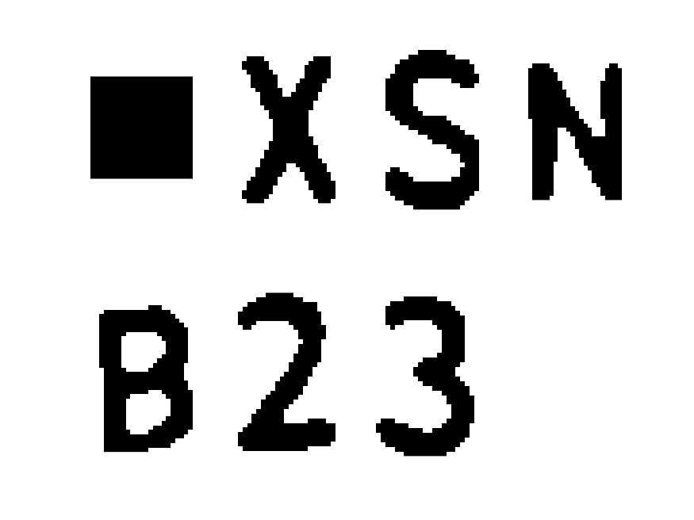

# License-Plate-Reader
Functions to pull license plate numbers off still frames. 

These functions use a number of different techniques, including color masking, and matrix correlation to extract, and recognise European license plate letters from still images of cars. 

These functions were designed to detect multiple plates, but at this stage, multiple plate detection remains inconsistent. 

## Prerequisites
These functions were written in MatLab 2015a, as well as the external library DIPImage 2.9. Installation instructions, and documentation for DIPImage can be found [here](http://www.diplib.org/download).

## Included functions
All included functions can be found in the folder [Functions](https://github.com/jyss88/License-Plate-Reader/tree/master/Functions)

A set of test images for demostration purposes can be found in the folder [Test Images](https://github.com/jyss88/License-Plate-Reader/tree/master/Functions/Test%20Images)

### [readLicensePlate.m](https://github.com/jyss88/License-Plate-Reader/blob/master/Functions/readLicensePlate.m)
Reads, and recognises the license plate number of an image of a car. Accepts an image as a Matlab Array as input, and returns a string of the recognised plate. Returns -1 if no plate detected.

This function works by:

1) Cropping the plate from the image
2) Extracting letters from the cropped plate
3) Matching extracted letters to a set of templates

### [create_templates.m](https://github.com/jyss88/License-Plate-Reader/blob/master/Functions/createTemplates.m)
This script creates the letter-number templates used in recognizeText. It segments a master font image into individual letters and numbers, converting them into logical MatLab arrays.

The font used is the Kentenken font, used on number plates in the European Union.

The master font image can be found in the folder [Kentenken font](https://github.com/jyss88/License-Plate-Reader/tree/master/Functions/Kentenken%20Font). The templates are saved into the .mat file 'templates.mat'.

### [createMaskHSV.m](https://github.com/jyss88/License-Plate-Reader/blob/master/Functions/createMaskHSV.m)
This function accepts an image as a MatLab array, and returns a logical mask, and subsequent masked image. The image is masked in the HSV color space, and is tuned to mask out yellow license plate objects. 

### [maskLicensePlate.m](https://github.com/jyss88/License-Plate-Reader/blob/master/Functions/maskLicensePlate.m)
This function accepts an image as a MatLab array, and outputs a binary mask, and a subsequent masked image of the license plate. Returns -1 if no license plate object is found.

The function works like so:

1) Mask image using createMaskHSV3.m
2) Filter and erode mask to remove salt & pepper noise
3) Close mask to close any holes in mask objects
4) Find and label objects in mask
5) Compute the area to perimeter squared ratio of the objects.
6) Select the first object with a suitable ratio, similar to an actual license plate
7) Mask the object, returning the mask, and the masked image. If at any stage, a plate is not found, return -1.

### [cropPlate.m](https://github.com/jyss88/License-Plate-Reader/blob/master/Functions/cropPlate.m)
This function accepts an image as a Matlab array, and returns the same image cropped, and rotated around a detected license plate object. Returns -1 if no plate object is found.

The function works like so:

1) Mask out license plate with maskLicensePlate.m
2) Detect orientation of plate object, and rotate, so that plate is completely horizontal.
3) Crop image around plate. Return cropped image. If an invalid input was given (i.e. not an image), return -1.

### [extractLetters.m](https://github.com/jyss88/License-Plate-Reader/blob/master/Functions/extractLetters.m)
This function accepts a cropped image of a license plate, and returns series of individual, extracted letter images. Returns -1 if no letters were detected. 

The function works as so:

1) Binarize image using a simple threshold filter.
2) Detect letter objects
3) Crop letter objects to individual images.
4) If input is invalid (not an image), return -1

### [recognizetext.m](https://github.com/jyss88/License-Plate-Reader/blob/master/Functions/recognizeText.m)
This function takes an array of individual letter images, and returns a string of recognized letters. Returns -1 on invalid input.

The function works by comparing the correlation coefficients of a letter to a set of prebuilt templates, and selecting the most likely character. 

### [num2letter2.m](https://github.com/jyss88/License-Plate-Reader/blob/master/Functions/num2Letter2.m)
A helped function for recognizetext3.m to match array indices to a specific letter/number.

### [testFunction.m](https://github.com/jyss88/License-Plate-Reader/blob/master/Functions/testFunction.m)
A test script demonstration the usage of readLicensePlate.

### [showStages.m](https://github.com/jyss88/License-Plate-Reader/blob/master/Functions/showStages.m)
A test script demonstrating the usage of the individual functions.

# Notes
The accuracy and efficiency of this project can still be greatly improved. In particular: 

* The OCR section remains quite rudimentary, and can be improved with greater machine learning techniques.
* Color thresholding is quite specific. The functions only extract yellow plates, and certain lighting conditions will cause the functions to fail to recognize plates.
* Verification - currently, objects are verified as license plates by a specific area to perimeter ratio. This could be improved by more advanced techniques, like contour checking, and corner finding.

This project was originally completed as an assessment piece at Delft University of Technology. Some revisions have been made since to be more presentable to a general audience.
